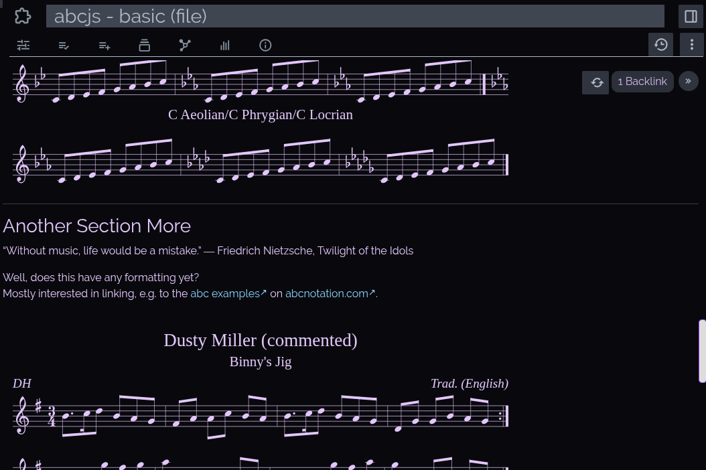
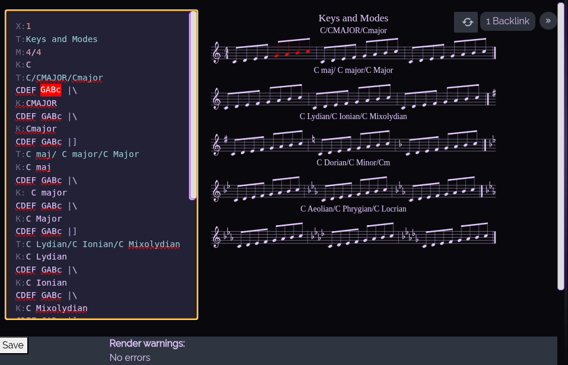
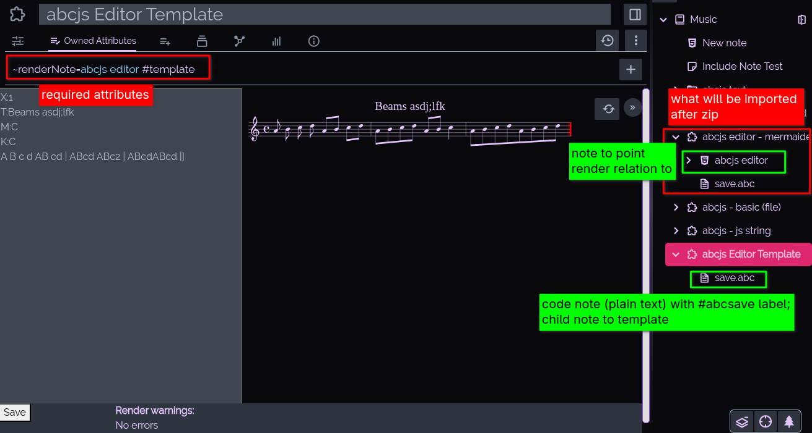
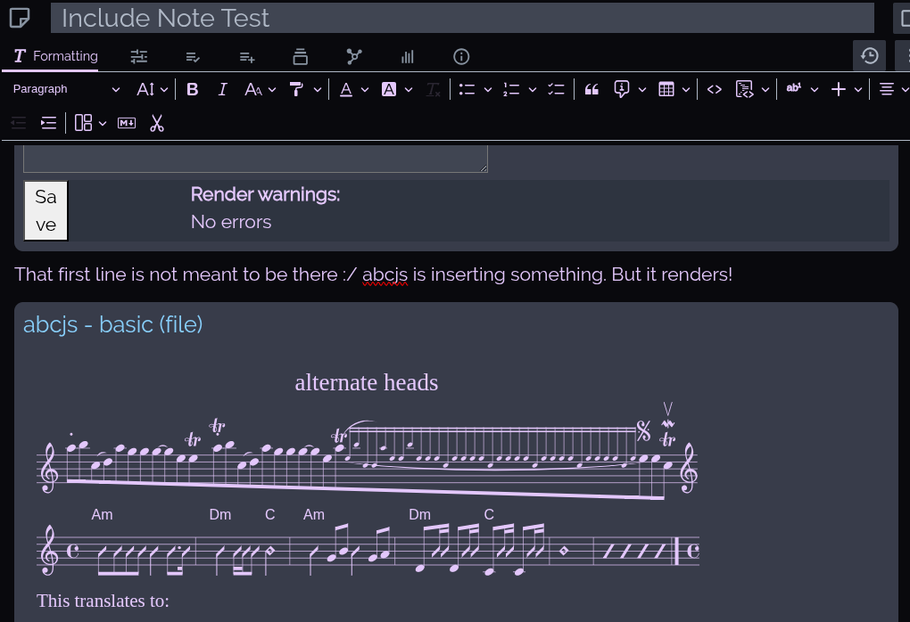
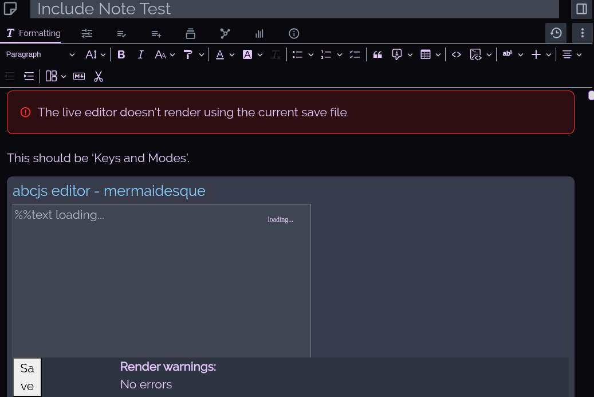

# Trilium ABCJS

Example of using the [abcjs library](https://docs.abcjs.net/) in Trilium.

## File Render
Uses a Render Note to render a html file that includes abc snippets in divs with ```class = 'abc_file'```.

Uses ```ABCJS.renderAbc``` as per [abcjs docs](https://docs.abcjs.net/visual/overview.html).


*Rendered HTML with abc snippets*

## Live Editor
Uses a Render Note to display the live editor. Can save to a text file.

Uses ```abcjs.Editor``` as per [abcjs docs](https://docs.abcjs.net/interactive/interactive-editor.html).


*Live editor page showing note selection in text area & render*

### Installation & Usage

#### File Render

* This is simply rendering a html file, which can be anything you want it to be; the js files are the novelty here
* The imported files will simply give an example of how the rendering works
* Maybe I'll make a template idk
* The important thing is to make sure the abc notes are wrapped with ```<div class='abc_file' id='file' style='display: none;'>```

#### Live Editor

* Import abcjs_editor.zip into Trilium
* Create a template note:
    * Render Note pointing to ```abcjs editor``` (html child note of ```abcjs editor - mermaidesque``` (the imported notes)) with a ```#template``` label
    * Create a child note to the template note: this should be a code note (plain text) with label ```abcSave```


*Visualisation of the notes required*

#### As An 'Include Note'

An option is to include the rendered notes into text notes. This works using the file render method but not the live editor.


*The file render as an include note*


*Live editor as an include note; uses the default textarea value instead of the savefile*

## To Do:
- [ ] make editor prettier
    - [ ] use ```div contenteditable=true``` instead of ```textarea``` to allow for syntax highlighting with highlight.js
- [ ] widget to create a note based on one of the abcjs templates and insert as an 'Include Note' in Text notes
- [ ] with the plugin and/or the simple file render, abcjs inserts ```.abcjs-dragging-in-progress text, .abcjs-dragging-in-progress tspan {-webkit-touch-callout: none; -webkit-user-select: none; -khtml-user-select: none; -moz-user-select: none; -ms-user-select: none; user-select: none;}Sheet Music``` <- figure out how to fix that
    - [ ] maybe related to [this issue](https://github.com/paulrosen/abcjs/issues/717)?
- [ ] fix live editor as include note not rendering properly