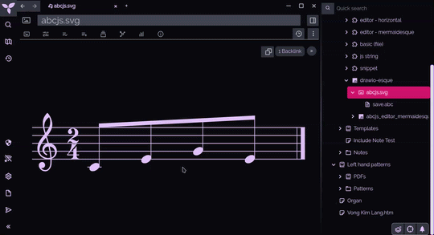
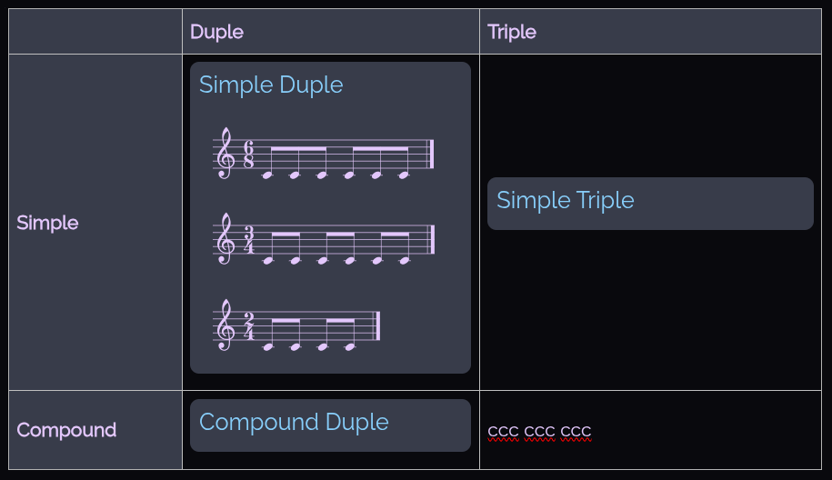

# Trilium ABCJS

Example of using the [abcjs library](https://docs.abcjs.net/) in Trilium. The following uses the ```abcjs-basic```, which can be found [here](https://docs.abcjs.net/overview/getting-started.html). If you imported both zip files, you could delete one version of the minimised library and clone it.

## File Render
Uses a Render Note to render a html file that includes abc snippets in divs with ```class = 'abc_file'```.

Uses ```ABCJS.renderAbc``` as per [abcjs docs](https://docs.abcjs.net/visual/overview.html).


*Rendered HTML with abc snippets*

## Live Editor
Uses a Render Note to display the live editor. Can save to a text file.

Uses ```abcjs.Editor``` as per [abcjs docs](https://docs.abcjs.net/interactive/interactive-editor.html).

My js code for the live editor was based on [tje](https://github.com/sottey/tje), mainly because of loading and saving using Trilium api.


*Live editor page showing note selection in text area & render*

## SVG Editor
Adapted the [trilium-drawio](https://github.com/SiriusXT/trilium-drawio) plugin to live edit a svg file, which can then be referenced in a text note. Saves to a text file. Mostly done because the live editor had issues when used as an include note (which is because I was using a render note as a template which points to the same one html note).

Uses the live editor above as an overlay.


*Click the svg image to access live editor which saves to the svg image & a text file*

## Installation & Usage

### File Render

* This is simply rendering a html file, which can be anything you want it to be; the js files are the novelty here
* The imported files will simply give an example of how the rendering works
* Maybe I'll make a template idk
* The important thing is to make sure the abc notes are wrapped with ```<div class='abc_file' id='file' style='display: none;'>```

### Live Editor

* Import abcjs_editor.zip into Trilium
* Create a template note:
    * Render Note pointing to ```abcjs editor``` (html child note of ```abcjs editor - mermaidesque``` (the imported notes)) with a ```#template``` label
    * Create a child note to the template note: this should be a code note (plain text) with label ```#abcSave```
* You can now create new notes with the template


*Visualisation of the notes required*

### As An 'Include Note'

An option is to include the rendered notes into text notes. This works using the file render method but not so well with the live editor.


*The file render as an include note*


*Live editor as an include note; uses the default textarea value instead of the savefile*

### SVG Editor
* Import abcjs_svg_editor.zip into Trilium
* Files should have the following labels:

| File  | Label  |
|----|----|
| svg_editor.js (or drawio-esque) | ```#widget``` |
| abcjs.svg | ```#template #originalFileName=abcjs.svg``` |
| save.abc | ```#abcSave``` |

* If you are also using trilium-drawio, you need to edit drawio.js to prevent conflicts

```javascript
if (note.mime != "image/svg+xml" || id_svg_dict[noteId].indexOf("mxfile") < 0) { return; }

// add the below line to limit trilium-drawio to that particular template file
if (!(note.hasLabel("originalFileName")) || note.getLabel("originalFileName").value != "drawio.svg"){return;}
// ^^^ add above line to only use drawio svg files ^^^

// alternatively, use below to exclude abcjs svg files from being targeted by trilium-drawio
if (!(note.hasLabel("originalFileName")) || note.getLabel("originalFileName").value == "abcjs.svg"){return;}
// ^^^ add above line to exclude abcjs svg files ^^^

setTimeout(function () {
    if ($("div.component.note-split:not(.hidden-ext) .note-detail-image-wrapper div.iframe-drawio").length > 0) { return; };//When switching tabs, if the iframe is already loaded, return
```
* svg is saved with a fixed colour (set by your theme's 'main-text-color')
    * I think it can be overridden by css ([x](https://docs.abcjs.net/visual/render-abc-options.html#foregroundcolor)) but I haven't tried it
    * Or just set the colour in the js script

## To Do:
- [ ] make editor prettier
    - [ ] use ```div contenteditable=true``` instead of ```textarea``` to allow for syntax highlighting with highlight.js
- [ ] widget to create a note based on one of the abcjs templates and insert as an 'Include Note' in Text notes
    - [ ] running into a problem with render notes as a template as they point to the same html file
        - 
            - Only one note can render at a time
        - [ ] using different html files would require linking to the js scripts somehow without being child notes (as that would be unwieldy)
    - [ ] fix live editor as include note not rendering properly unless trilium is reloaded
- [ ] with the plugin and/or the simple file render, abcjs inserts ```.abcjs-dragging-in-progress text, .abcjs-dragging-in-progress tspan {-webkit-touch-callout: none; -webkit-user-select: none; -khtml-user-select: none; -moz-user-select: none; -ms-user-select: none; user-select: none;}Sheet Music``` into the html file, which is meant to be the style tag for the svg
- [ ] dragging works; maybe when notes dragged, the textarea value is changed?
- [ ] refactor code
    - [ ] svg editor code
    - [ ] make code more modular to share functions between the different features
- [ ] fix svg editor behaviour when switching tabs while editor is still open

Lmao, with this amount of issues, I should just use Github's issues tracker.